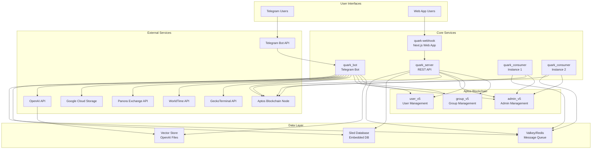

# Nova Architecture Documentation

## System Overview

**Nova** (previously called Quark AI) is a sophisticated AI-powered Telegram bot ecosystem with deep blockchain integration on Aptos. Designed for communities and individual users, Nova provides intelligent conversational AI, comprehensive group management tools, automated payment systems, content moderation, DAO governance, and decentralized finance (DeFi) capabilities. The system is built for scale, all integrated with the Aptos blockchain for transparent financial operations.

## Core Architecture

### High-Level Architecture

The system follows a microservices architecture with the following main components:

1. **quark_bot** - Main Telegram bot service
2. **quark_server** - REST API server
3. **quark_consumer** - Payment processing services (2 instances)
4. **quark-webhook** - Next.js web application
5. **quark_core** - Shared utilities and helpers
6. **contracts** - Aptos blockchain smart contracts

## Component Details

### 1. quark_bot (Telegram Bot Service)

**Primary Function**: Main Telegram bot handling user interactions and AI-powered conversations.

**Key Modules**:
- `ai/` - AI conversation handling, OpenAI integration, vector stores, moderation, summarization
- `bot/` - Core bot handlers, command processing, user authentication
- `assets/` - Media handling and command image collection
- `callbacks.rs` - Telegram callback query handling
- `dao/` - DAO proposal creation, voting, and governance
- `filters/` - Custom trigger-response filters with match types
- `group/` - Group credentials, document library, vector store management
- `payment/` - Payment preferences, balance queries, transfers
- `scheduled_payments/` - Recurring automated payments
- `scheduled_prompts/` - Automated AI-generated messages
- `welcome/` - Member onboarding and welcome messages
- `command_settings/` - Per-group command enable/disable
- `summarization_settings/` - Conversation summary configuration
- `user_conversation/` - Conversation state and history
- `user_model_preferences/` - AI model selection and preferences

**Key Features**:
- **Advanced AI Conversations**: Context-aware AI with multiple models, tool calling, web search, image generation
- **Group Management Suite**: 
  - Content moderation with AI-powered sentinel
  - Custom filters with trigger-response automation
  - Document library with RAG capabilities (separate user/group vector stores)
  - Welcome message customization
  - Command enable/disable controls
  - Group ID migration tools
- **DAO Governance**: Proposal creation, token-weighted voting, automated notifications
- **Payment & Blockchain**: Individual and group wallets, multi-token support, balance queries, transfers
- **Automation**: Scheduled prompts (5m to monthly), scheduled payments with flexible cadences
- **Asset Management**: Media handling, image upload to Google Cloud Storage
- **Summarization**: Automatic conversation summaries for context retention
- **Market Data**: Real-time crypto data from GeckoTerminal and Panora Exchange
- **Cron Jobs**: Automated token list updates, DAO notifications, scheduled task execution

**Database**: Embedded Sled database for user data, conversations, and credentials

### 2. quark_server (REST API Server)

**Primary Function**: HTTP API server providing programmatic access to system functionality.

**Key Modules**:
- `admin/` - Administrative endpoints and management
- `docs/` - API documentation endpoints
- `info/` - System information and status
- `pay_users/` - Payment processing endpoints
- `purchase/` - Purchase transaction handling
- `middlewares/` - HTTP middleware for authentication and request processing

**Key Features**:
- RESTful API for external integrations
- Payment processing endpoints
- Administrative functionality
- System monitoring and health checks

### 3. quark_consumer (Payment Processing Services)

**Primary Function**: Asynchronous payment processing and blockchain transaction handling.

**Key Modules**:
- `admin/` - Administrative payment processing
- `calculator/` - Payment calculations and token pricing

**Key Features**:
- **Distributed Processing**: Two instances for load balancing
- **Message Queue Integration**: Redis/Valkey for task distribution
- **Blockchain Integration**: Direct Aptos blockchain interactions
- **Payment Calculations**: Dynamic pricing and fee calculations

### 4. quark-webhook (Next.js Web Application)

**Primary Function**: Web interface for users to interact with the system through a browser.

**Key Features**:
- **Modern React/Next.js Architecture**: Server-side rendering and optimal performance
- **Wallet Integration**: Aptos Connect
- **Responsive Design**: Mobile-first approach with Tailwind CSS
- **Account Management**: User login, fund management, and withdrawal functionality

**Key Pages**:
- Login with account status
- Fund management
- Withdrawal interface
- Launch parameters configuration
- Theme customization

### 5. quark_core (Shared Library)

**Primary Function**: Common utilities and helpers shared across services.

**Key Modules**:
- `helpers/` - Utility functions, JWT handling, GPG encryption, bot commands

### 6. contracts (Aptos Smart Contracts)

**Primary Function**: Blockchain smart contracts managing users, groups, and administration.

**Contracts**:
- **admin.move**: Administrative functions and system management
- **user.move**: User account management and authentication
- **group.move**: Group management and shared resources

**Key Features**:
- **Resource Account Management**: Automated wallet creation and management
- **Group Functionality**: Shared group accounts and permissions
- **Administrative Controls**: System-wide configuration and management

## Data Flow Architecture

### User Interaction Flow

1. **Telegram Users** interact with the bot through the Telegram API
2. **quark_bot** processes messages and commands
3. **AI Processing** occurs for intelligent responses
4. **Blockchain Transactions** are queued through Redis/Valkey
5. **quark_consumer** instances process payments asynchronously
6. **Results** are sent back to users through Telegram

### Payment Processing Flow

1. **Payment Request** initiated by user
2. **Request Validation** by quark_bot or quark_server
3. **Task Queuing** to Redis/Valkey message queue
4. **Asynchronous Processing** by quark_consumer instances
5. **Blockchain Interaction** with Aptos smart contracts
6. **Result Notification** back to user

### Web Application Flow

1. **User Access** through web browser
2. **quark-webhook** serves Next.js application
3. **API Calls** to quark_server for data
4. **Authentication** and session management
5. **Wallet Integration** for blockchain interactions

## Technology Stack

### Backend Technologies
- **Language**: Rust
- **Web Framework**: Axum (for REST API)
- **Database**: Sled (embedded key-value store)
- **Message Queue**: Redis/Valkey
- **AI Integration**: OpenAI GPT models
- **Blockchain**: Aptos Move contracts

### Frontend Technologies
- **Framework**: Next.js 15 with React
- **Styling**: Tailwind CSS
- **Wallet Integration**: Aptos Connect
- **State Management**: React Context API

### Infrastructure
- **Containerization**: Docker and Docker Compose
- **Orchestration**: Docker Compose with multiple service instances
- **Storage**: Google Cloud Storage for media files
- **Monitoring**: Built-in health checks and logging

## Security Features

### Authentication & Authorization
- **JWT Tokens**: Secure user and group authentication
- **GPG Encryption**: Sensitive data protection
- **Resource Accounts**: Automated blockchain wallet management
- **Multi-level Authorization**: User, group, and admin permissions

### Data Protection
- **Encrypted Storage**: Sensitive user data encryption
- **Secure Communication**: TLS/SSL for all external communications
- **Input Validation**: Comprehensive request validation
- **Rate Limiting**: Protection against abuse

## Deployment Architecture

### Container Strategy
- **Multi-container Setup**: Each service in its own container
- **Load Balancing**: Multiple consumer instances for payment processing
- **Volume Management**: Persistent storage for database and media
- **Environment Configuration**: Flexible environment-based configuration

### Scaling Capabilities
- **Horizontal Scaling**: Multiple consumer instances for high throughput
- **Vertical Scaling**: Resource allocation per service
- **Database Scaling**: Embedded database with efficient key-value operations
- **Message Queue**: Redis/Valkey for distributed task processing

## Integration Points

### External API Integrations
- **Telegram Bot API**: Primary user interface
- **OpenAI API**: AI conversation capabilities
- **Aptos Blockchain**: Smart contract interactions
- **Panora Exchange**: Token pricing and exchange data
- **Google Cloud Storage**: Media file storage
- **GeckoTerminal**: Additional market data

### Internal Service Communication
- **REST API**: HTTP-based service communication
- **Message Queue**: Asynchronous task distribution
- **Shared Database**: Common data access patterns
- **Event-driven Architecture**: Reactive system design

## Future Considerations

### Scalability Improvements
- **Caching Layer**: Redis for frequently accessed data

This architecture provides a robust, scalable foundation for an AI-powered Telegram bot with blockchain integration, supporting both individual users and group interactions while maintaining security and performance standards. 